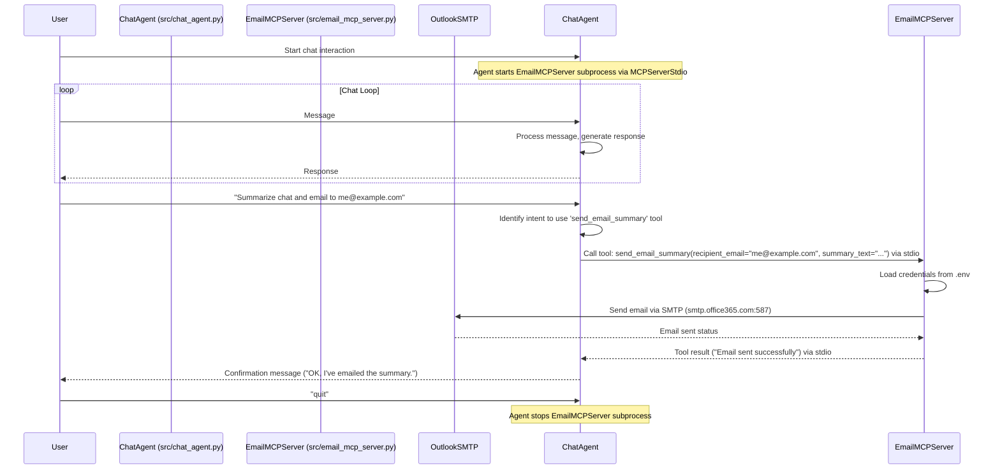

# MCP Email Server Implementation Plan

**Goal:** Create an MCP server that provides an email-sending tool, and modify the existing chat agent (`src/chat_agent.py`) to connect to this server and use the tool.

**Plan Details:**

1.  **Create `src/email_mcp_server.py`:**
    *   **Framework:** Use `FastMCP` from the `mcp` library.
    *   **Tool Definition:**
        *   Define an asynchronous function decorated with `@server.tool()`, named `send_email_summary`.
        *   **Inputs:** `recipient_email: str`, `summary_text: str`.
        *   **Functionality:** Implement email sending using Python's `smtplib` and `email.message` modules, configured for Outlook.
        *   **Credentials:** Load `SENDER_EMAIL`, `SENDER_PASSWORD`, `SMTP_SERVER`, `SMTP_PORT` from the `.env` file.
        *   **Output:** Return a string indicating success or failure.
    *   **Server Execution:** Include `if __name__ == '__main__': server.run()`.

2.  **Update `src/chat_agent.py` (MCP Client):**
    *   **Import:** Add `from pydantic_ai.mcp import MCPServerStdio`.
    *   **Server Configuration:** Create an `MCPServerStdio` instance to run the server script:
        ```python
        email_server = MCPServerStdio(
            'python',
            args=['src/email_mcp_server.py']
        )
        ```
    *   **Agent Initialization:** Add the `mcp_servers` parameter to the `Agent` constructor:
        ```python
        agent = Agent(
            model_instance,
            system_prompt='Be a helpful chat assistant.',
            mcp_servers=[email_server] # Add server config
        )
        ```
    *   **Server Lifecycle:** Make the main execution loop asynchronous (`async def main(): ... asyncio.run(main())`) and wrap the agent interaction part within `async with agent.run_mcp_servers():`.

3.  **Update `.env` File:**
    *   Add the following variables:
        *   `SENDER_EMAIL=<your_outlook_email>`
        *   `SENDER_PASSWORD=<your_outlook_app_password_or_password>`
        *   `SMTP_SERVER=smtp.office365.com`
        *   `SMTP_PORT=587`
    *   *(Note: Using an App Password is recommended if Multi-Factor Authentication is enabled for your Outlook account).*

**Workflow Diagram:**



**Connection Method:** Stdio (Chat Agent manages the Email Server subprocess).
**Email Provider:** Outlook.
**Credentials:** Stored in `.env`.